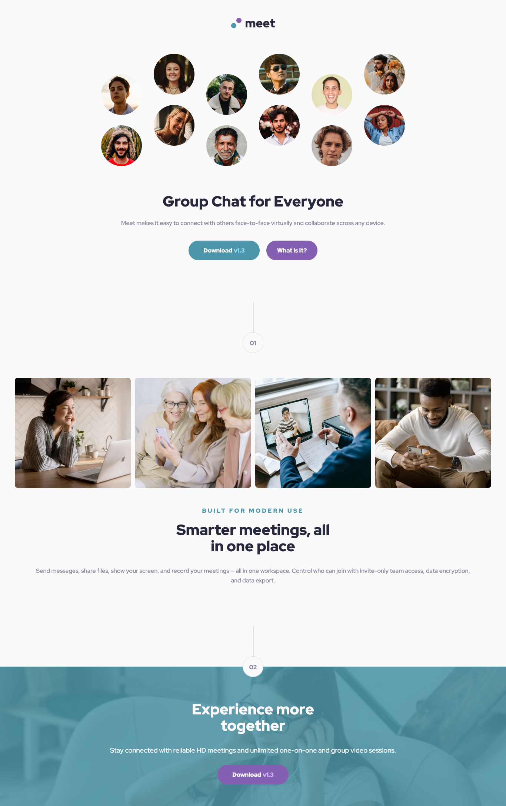

# Frontend Mentor - Meet landing page solution

This is a solution to the [Meet landing page challenge on Frontend Mentor](https://www.frontendmentor.io/challenges/meet-landing-page-rbTDS6OUR). Frontend Mentor challenges help you improve your coding skills by building realistic projects. 

## Table of contents

- [Overview](#overview)
  - [The challenge](#the-challenge)
  - [Screenshot](#screenshot)
  - [Links](#links)
- [My process](#my-process)
  - [Built with](#built-with)
  - [What I learned](#what-i-learned)
  - [Continued development](#continued-development)
  - [Useful resources](#useful-resources)
- [Author](#author)

**Note: Delete this note and update the table of contents based on what sections you keep.**

## Overview

### The challenge

Users should be able to:

- View the optimal layout depending on their device's screen size
- See hover states for interactive elements

### Screenshot

### Links

- Solution URL: [Solution URL](https://www.frontendmentor.io/solutions/meet-landing-page-with-sass-flexbox-y-grid-RXVXUF7vd)
- Live Site URL: [Live site URL](https://mariafmedinae.github.io/Meet-landing-page/)

## My process

### Built with

- Semantic HTML5 markup
- CSS custom properties
- Flexbox
- CSS Grid
- Mobile-first workflow
- [Sass](https://sass-lang.com/) - CSS Preprocessor 

### What I learned

I've learned that is a better practice to use the a anchor tag <a> instead the button tag <button> when the button opens a new web tab o it is used to navigate in the same web page.

Also, I started to use Sass. In this project learned  about variables, maps, nesting and mixin.

### Continued development

I'm going to keep using Sass to improve the topics I've learned in this project and know about new ones. 

### Useful resources

- [Free Code Camp Sass Tutorial](https://www.youtube.com/watch?v=_a5j7KoflTs) - This tutorial helped me a lot because explain the principle Sass concepts and the project example made it easier for me to work in this challenge.

## Author

- Frontend Mentor - [@mariafmedinae](https://www.frontendmentor.io/profile/mariafmedinae)
